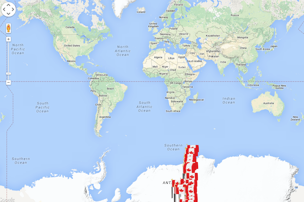
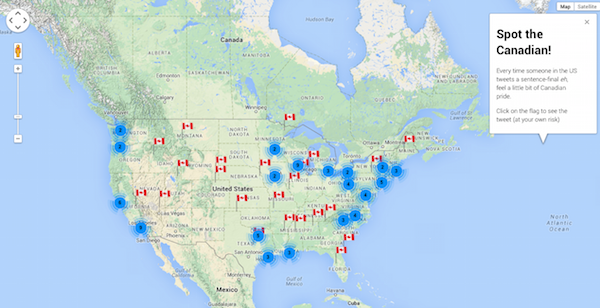

I'm learning to do stuff! 

As a first project I wanted to learn to use the twitter API, and play around a little bit with visualization. I was inspired by [this research](http://languagelog.ldc.upenn.edu/nll/?p=14015), that maps the uses of 'um' and 'uh' by Americans on twitter. 

Here in the US, I'm teased mercilessly, particularly by my linguist colleagues, for my Canadian 'eh'. I figured I could use a little bit of solidarity, so I set about to seek down Canadian expats living in the US by searching twitter for 'eh'. With the help of my [super smart girlfriend](http://mlauter.github.io) I used tweepy to look for tweets containing geolocation data, originating in the United States, in English, and containing the letters 'eh' as an isolated word. This worked pretty well as a first pass, but it turns out that lots of people use 'eh' to express basically the equivalent of 'meh'. 

Some examples: 

- "Eh I think you'll survive the pain it's quick"
- "Eh I'm already over it"
- "Eh. Forget it."

So I refined it slightly to look for 'eh's that are either after a word boundary or follow a comma. This rules out sentence-initial 'eh's, and also matches the correct prosody for the Canadian eh. This seemed to work in that most of the tweets I'm capturing are what I had in mind (though they're certainly not necessarily from Canadians, but nevermind). 

- "I hear you were trotting round my parts Monday, eh?"
- "good world we live in, eh?"
- and my personal favourite: "A Seattle driver just waved thanks to me for letting him merge? Oh wait, he had Canadian plates, eh?"

Ok, so maybe we're not getting *Canadians* specifically, but whatever. The next step was to plot the tweets on google maps using their API. That was pretty straightforward; I had a few problems with the coordinates originally (it looked like this)   

  

Basically the only fancy thing I did was to use [marker clusterer](http://google-maps-utility-library-v3.googlecode.com/svn/trunk/markerclusterer/) to handle overcrowding of icons on the map. The successful version looks like this:   

  

Last step was to deploy on heroku! Check it out [here](https://secure-plains-4945.herokuapp.com). Code is [here](https://github.com/mw1602/EhSpy). 

